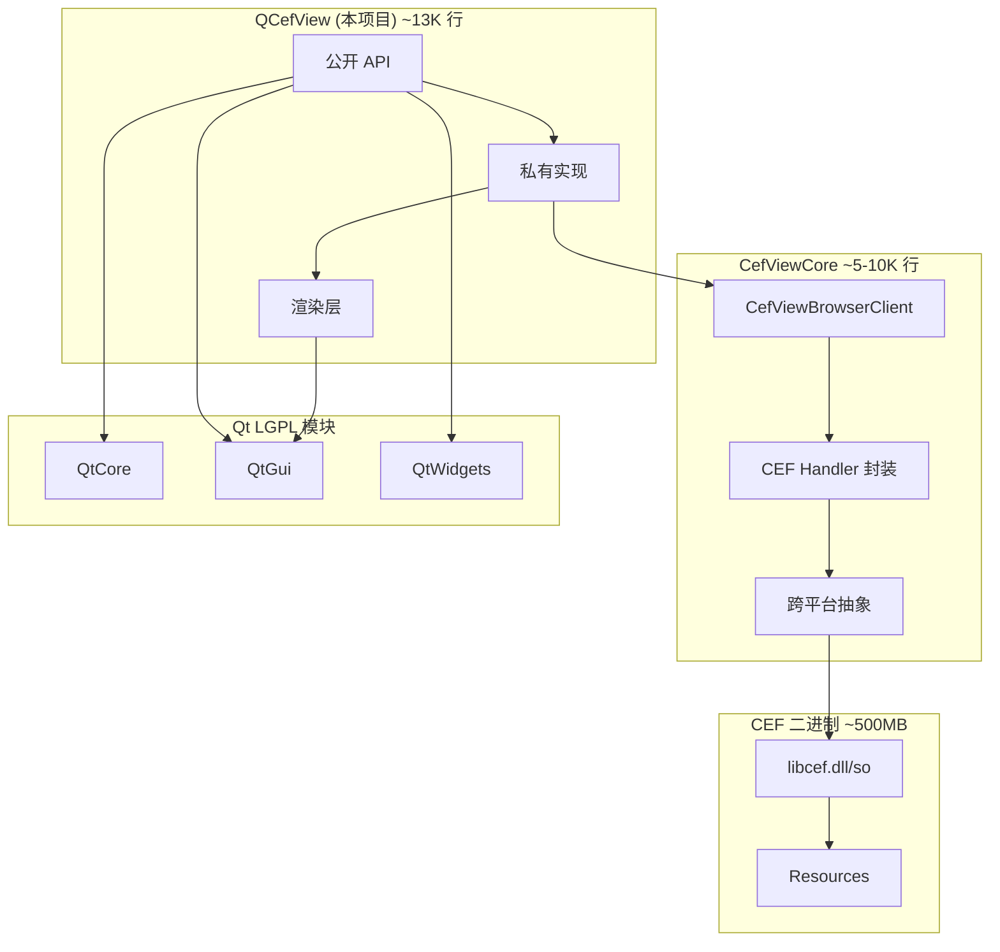

# QCefView 代码量与依赖分析

**分析日期**: 2026-04-10
**基于版本**: QCefView main 分支

---

## 1. 代码量统计

### 1.1 总体统计

| 指标 | 数量 |
|------|------|
| **总代码行数** | ~13,000 行 |
| **头文件** | 35 个 |
| **源文件** | 45 个 |
| **CMake 文件** | 5 个 |
| **UI 文件** | 1 个 |

### 1.2 目录分布

```
总代码量: 13,023 行

├── include/          1,935 行 (15%)  - 公开 API
├── src/             10,324 行 (79%)  - 核心实现
│   ├── details/      (主要实现)
│   │   ├── utils/    1,646 行        - 工具类
│   │   └── render/     517 行        - 渲染层
│   ├── win/            965 行        - Windows 平台
│   ├── mac/            668 行        - macOS 平台
│   └── linux/          150 行        - Linux 平台
└── example/            764 行 (6%)   - 示例程序
```

### 1.3 公开 API 头文件详情

| 文件 | 行数 | 说明 |
|------|------|------|
| `QCefView.h` | 528 | 核心视图类 |
| `QCefSetting.h` | 440 | 浏览器设置 |
| `QCefConfig.h` | 362 | 全局配置 |
| `QCefContext.h` | 149 | CEF 上下文 |
| `QCefDownloadItem.h` | 177 | 下载管理 |
| `QCefQuery.h` | 109 | JS 查询 |
| `QCefEvent.h` | 88 | C++ 事件 |
| `QCefView_global.h` | 58 | 导出宏 |
| `CefVersion.h` | 24 | 版本信息 |

### 1.4 主要源文件 (TOP 10)

| 文件 | 行数 | 职责 |
|------|------|------|
| `QCefViewPrivate.cpp` | 1,715 | 核心私有实现 |
| `KeyboardUtils.cpp` | 726 | 键盘事件处理 |
| `DX11RenderBackend.cpp` | 725 | Windows DX11 渲染 |
| `QCefSetting.cpp` | 486 | 设置类实现 |
| `QCefView.cpp` | 476 | 公开 API 实现 |
| `QCefConfig.cpp` | 365 | 配置类实现 |
| `CCefClientDelegate.h` | 309 | CEF 回调代理 |
| `QCefViewPrivate.h` | 308 | 私有类定义 |
| `ICefViewRenderer.h` | 238 | 渲染器接口 |
| `CCefClientDelegate_RenderHandler.cpp` | 228 | OSR 渲染处理 |

---

## 2. 依赖分析

### 2.1 依赖关系图



### 2.2 主要依赖

#### Qt (必需)

| 模块 | 用途 | 许可证 |
|------|------|--------|
| QtCore | 核心功能、事件循环 | LGPL v3 |
| QtGui | GUI 基础、图像处理 | LGPL v3 |
| QtWidgets | Widget 控件 | LGPL v3 |
| QtGuiPrivate (Linux) | 平台私有接口 | LGPL v3 |

**平台特定依赖**:
- Windows: 无额外依赖
- Linux: X11, OpenGL
- macOS: Metal, QuartzCore

#### CEF (Chromium Embedded Framework)

| 属性 | 值 |
|------|-----|
| 当前版本 | 142.0.15 (Chromium 142) |
| 许可证 | BSD 3-Clause |
| 获取方式 | CefViewCore 自动下载 |
| 下载源 | https://cef-builds.spotifycdn.com |

**二进制大小 (每平台)**:
| 组件 | 压缩 | 解压后 |
|------|------|--------|
| 完整包 | 150-200 MB | 500-600 MB |
| libcef | - | 80-120 MB |
| Resources | - | ~100 MB |

#### CefViewCore

| 属性 | 值 |
|------|-----|
| 仓库 | https://github.com/CefView/CefViewCore |
| 版本 | 454c7246 (commit hash) |
| 获取方式 | CMake FetchContent |
| 估计代码量 | 5,000-10,000 行 |

**功能**:
- CEF 初始化和生命周期管理
- 跨平台抽象层
- CEF Handler 基础实现
- CEF 二进制自动下载

---

## 3. 许可证分析

### 3.1 许可证兼容性

| 组件 | 许可证 | 商业使用 | 源码公开 |
|------|--------|----------|----------|
| QCefView | LGPL v3 | ✅ 是 | ⚠️ 修改需开源 |
| CEF | BSD 3-Clause | ✅ 是 | ❌ 否 |
| Qt (LGPL) | LGPL v3 | ✅ 是 | ⚠️ 修改需开源 |
| Chromium | BSD/MIT 等 | ✅ 是 | ❌ 否 |

### 3.2 LGPL 合规要点

使用 LGPL v3 许可证的关键要求:

1. **动态链接**: 使用动态链接方式使用 Qt 和 QCefView
2. **源码提供**: 如果修改了 QCefView 源码，需公开修改部分
3. **许可证声明**: 在应用中包含许可证声明
4. **替换权**: 用户应能替换 LGPL 库

---

## 4. 代码复杂度评估

### 4.1 核心复杂度

| 模块 | 复杂度 | 说明 |
|------|--------|------|
| QCefViewPrivate | 高 | 1700+ 行，管理 CEF 生命周期、事件转换 |
| CCefClientDelegate | 中高 | 实现 10+ CEF Handler 接口 |
| 渲染层 | 中 | 硬件/软件渲染，多平台抽象 |
| 公开 API | 低 | 清晰的 PIMPL 封装 |

### 4.2 平台代码占比

```
平台特定代码: ~1,783 行 (14%)

Windows: 965 行 (54%)  - DX11 渲染后端
macOS:   668 行 (37%)  - Metal 渲染后端
Linux:   150 行 (9%)   - OpenGL 渲染后端
```

---

## 5. 构建依赖下载分析

### 5.1 构建时下载内容

```
CMake Configure 阶段:
├── CefViewCore (Git clone)        ~5-10 MB
│   └── 包含 CMake 配置和头文件
│
└── CEF SDK (自动下载)             ~150-200 MB 压缩
    ├── libcef.dll/so/dylib        ~80-120 MB
    ├── libcef.lib (导入库)        ~10 MB
    ├── include/ (头文件)          ~5 MB
    └── Resources/                 ~100 MB
        ├── locales/
        └── *.pak 文件
```

### 5.2 CI 构建缓存

项目使用 GitHub Actions 缓存 CEF 文件:
```yaml
# .github/workflows/build-linux-x86_64.yml
- name: Cache CEF folders
  uses: actions/cache@v3
  with:
    path: ${{github.workspace}}/CefViewCore/dep
    key: ${{ runner.os }}-core-dep-cef
```

---

## 6. 对 QCefFrame 的影响

### 6.1 代码量对比

| 项目 | 代码量 | 说明 |
|------|--------|------|
| QCefView (原项目) | ~13,000 行 | QWidget 版本 |
| QCefFrame 新增 | ~3,000-5,000 行 | ARM64 工具链 + QML 支持 |
| **总计** | ~16,000-18,000 行 | |

### 6.2 ARM64 交叉编译依赖

需要额外准备:
| 依赖 | 大小 | 来源 |
|------|------|------|
| CEF ARM64 | ~150-200 MB | cef-builds.spotifycdn.com |
| Qt ARM64 | ~100-200 MB | 自编译或 Buildroot |
| aarch64-linux-gnu | ~50 MB | 系统包管理器 |

### 6.3 源码 vs 二进制

| 类型 | 大小 | 说明 |
|------|------|------|
| **源码** | ~18,000 行代码 | 可维护、可修改 |
| **二进制依赖** | ~600+ MB | Qt + CEF (每平台) |

---

## 7. 总结

### 7.1 代码规模

QCefView 是一个**精简高效**的 CEF-Qt 集成库:
- 有效代码量仅 **~13,000 行**
- 代码组织清晰，分层合理
- 平台特定代码占比合理 (14%)

### 7.2 依赖特点

| 特点 | 说明 |
|------|------|
| ✅ 二进制依赖 | CEF 以预编译形式提供，无需编译 Chromium |
| ✅ 自动下载 | CMake 自动下载 CEF 和 CefViewCore |
| ⚠️ 体积较大 | CEF 二进制每平台 ~500-600 MB |
| ✅ 许可证友好 | LGPL + BSD，支持商业使用 |

### 7.3 开发成本估算

| 任务 | 代码量预估 | 难度 |
|------|-----------|------|
| ARM64 工具链配置 | ~100 行 CMake | 低 |
| CEF ARM64 支持 | 修改下载脚本 | 低 |
| QML 支持 (QCefQuickItem) | ~2,000 行 | 中高 |
| 测试和示例 | ~500 行 | 低 |
