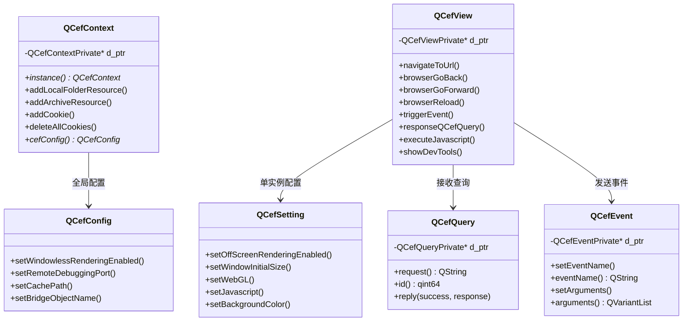
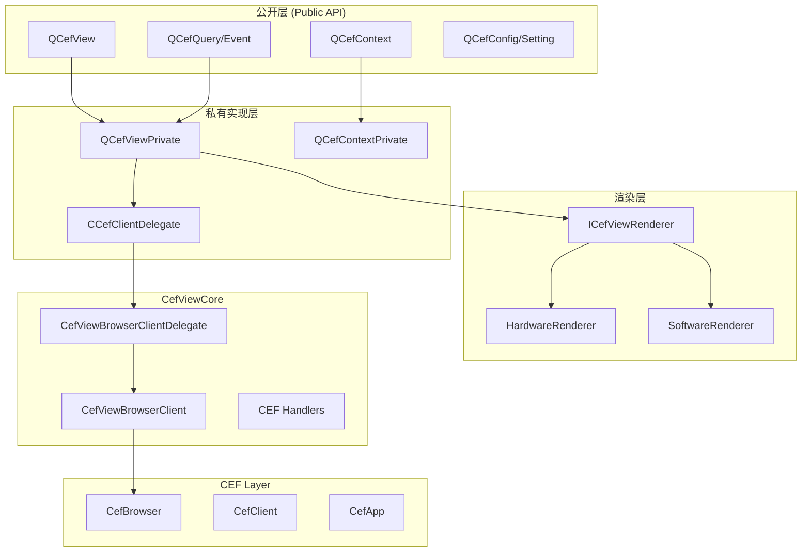
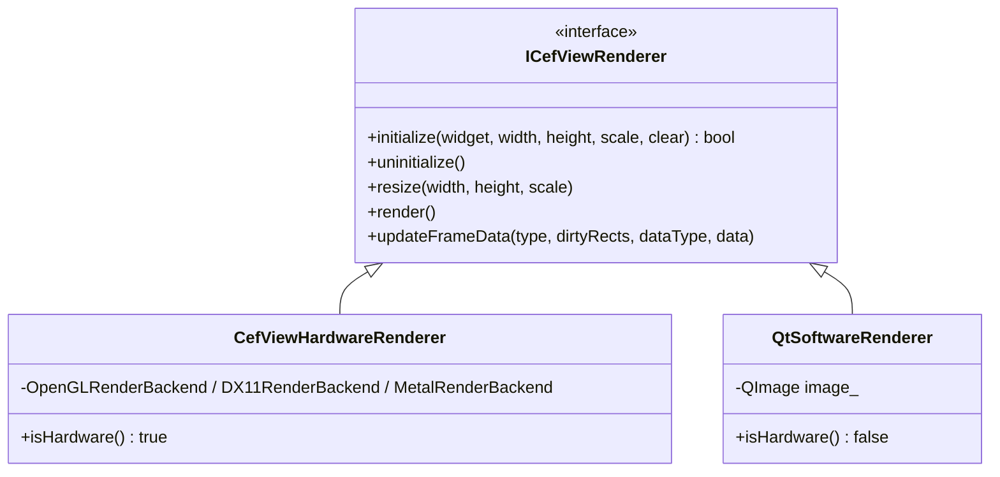
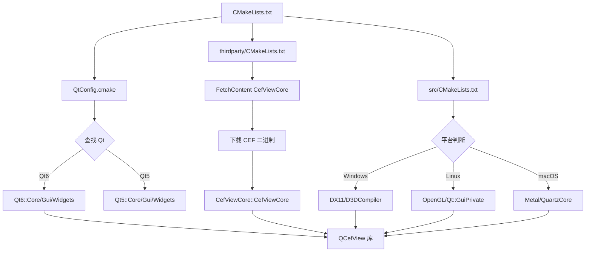

# QCefView 项目架构分析

**日期**: 2026-04-10
**版本**: 基于 QCefView main 分支 (CEF 142.0.15 / Chromium 142)

---

## 1. 项目概述

QCefView 是一个将 CEF (Chromium Embedded Framework) 集成到 Qt 应用程序的库。它提供了 QWidget 形式的浏览器视图，支持 OSR (Off-Screen Rendering) 和原生窗口两种渲染模式。

### 1.1 核心特性

- **跨平台**: Windows / Linux / macOS
- **双渲染模式**: OSR (离屏渲染) 和 NCW (原生子窗口)
- **Qt 集成**: 基于 QWidget，支持 Qt 5 和 Qt 6
- **JS-C++ 通信**: QCefQuery (JS→C++) 和 QCefEvent (C++→JS)

---

## 2. 目录结构

```
QCefView/
├── include/                    # 公开 API 头文件
│   ├── QCefView.h             # 核心视图类 (QWidget)
│   ├── QCefContext.h          # CEF 上下文管理
│   ├── QCefConfig.h           # 全局配置
│   ├── QCefSetting.h          # 单个浏览器设置
│   ├── QCefQuery.h            # JS 查询请求
│   ├── QCefEvent.h            # C++ 事件
│   ├── QCefDownloadItem.h     # 下载项
│   └── CefVersion.h           # CEF 版本 (自动生成)
│
├── src/                       # 源码实现
│   ├── QCefView.cpp           # 公开 API 实现
│   ├── QCefContext.cpp
│   ├── QCefConfig.cpp
│   ├── QCefSetting.cpp
│   ├── QCefQuery.cpp
│   ├── QCefEvent.cpp
│   ├── QCefDownloadItem.cpp
│   │
│   ├── details/               # 内部实现
│   │   ├── QCefViewPrivate.h  # 核心私有类
│   │   ├── QCefContextPrivate.h
│   │   ├── CCefClientDelegate.h  # CEF 回调代理
│   │   ├── QCefWindow.h       # OSR 窗口封装
│   │   │
│   │   ├── render/            # 渲染层
│   │   │   ├── ICefViewRenderer.h      # 渲染器接口
│   │   │   ├── CefViewRendererFactory.h
│   │   │   ├── hardware/      # 硬件加速渲染
│   │   │   │   ├── CefViewHardwareRenderer.h
│   │   │   │   ├── DX11RenderBackend.h   # Windows
│   │   │   │   ├── OpenGLRenderBackend.h # Linux
│   │   │   │   └── MetalRenderBackend.h  # macOS
│   │   │   └── software/      # 软件渲染
│   │   │       └── QtSoftwareRenderer.h
│   │   │
│   │   └── utils/             # 工具类
│   │       ├── ValueConvertor.h
│   │       ├── MenuBuilder.h
│   │       ├── KeyboardUtils.h
│   │       ├── CursorUtils.h
│   │       └── DragAndDropUtils.h
│   │
│   ├── linux/                 # Linux 平台代码
│   ├── mac/                   # macOS 平台代码
│   └── win/                   # Windows 平台代码
│
├── thirdparty/                # CefViewCore 依赖
│   └── CMakeLists.txt         # FetchContent 下载 CefViewCore
│
├── cmake/                     # CMake 配置
│   └── QtConfig.cmake         # Qt 查找配置
│
├── example/                   # 示例程序
│   └── QCefViewTest/
│       ├── main.cpp           # 入口
│       ├── MainWindow.*       # 主窗口
│       └── websrc/            # 测试网页
│
└── scripts/                   # 构建脚本
```

---

## 3. 核心类分析

### 3.1 类关系图



### 3.2 公开 API 详细说明

#### QCefContext (全局上下文)

**职责**: 管理 CEF 生命周期，全局资源配置

```cpp
// 初始化流程 (main.cpp)
QCefConfig config;
config.setWindowlessRenderingEnabled(true);
config.setRemoteDebuggingPort(9000);
config.setCachePath("/path/to/cache");

QCefContext cefContext(&app, argc, argv, &config);  // 初始化 CEF
// ... 应用运行 ...
// QCefContext 析构时自动清理 CEF
```

**关键方法**:
| 方法 | 说明 |
|------|------|
| `instance()` | 获取单例 |
| `addLocalFolderResource(path, url)` | 映射本地目录到 URL |
| `addArchiveResource(path, url)` | 映射 zip 文件到 URL |
| `addCookie()` | 添加全局 Cookie |
| `addCrossOriginWhitelistEntry()` | 跨域白名单 |

#### QCefView (浏览器视图)

**职责**: CEF 浏览器的 QWidget 封装

**继承关系**: `QWidget → QCefView`

**关键信号**:
| 信号 | 说明 |
|------|------|
| `loadingStateChanged` | 加载状态变化 |
| `loadStart/loadEnd/loadError` | 加载生命周期 |
| `titleChanged` | 标题变化 |
| `addressChanged` | URL 变化 |
| `cefQueryRequest` | 收到 JS 查询请求 |
| `invokeMethod` | JS 调用方法 |
| `reportJavascriptResult` | JS 执行结果 |

**关键方法**:
| 方法 | 说明 |
|------|------|
| `navigateToUrl(url)` | 导航到 URL |
| `navigateToString(content)` | 加载 HTML 内容 |
| `triggerEvent(event)` | 发送事件到 JS |
| `responseQCefQuery(query)` | 响应 JS 查询 |
| `executeJavascript(code)` | 执行 JS 代码 |

#### QCefQuery (JS → C++ 查询)

**职责**: 封装来自 JavaScript 的查询请求

```cpp
// C++ 端接收
connect(view, &QCefView::cefQueryRequest,
        [](const QCefBrowserId& browserId,
           const QCefFrameId& frameId,
           const QCefQuery& query) {
    QString request = query.request();
    // 处理请求...
    query.reply(true, "response data");
});
```

```javascript
// JavaScript 端发送
window.cefQuery({
    request: "getUserInfo",
    onSuccess: function(response) { console.log(response); },
    onFailure: function(error) { console.error(error); }
});
```

#### QCefEvent (C++ → JS 事件)

**职责**: 从 C++ 向 JavaScript 发送事件

```cpp
// C++ 端发送
QCefEvent event("onUserLogin");
event.setArguments({ "John", 25 });
view->triggerEvent(event);
```

```javascript
// JavaScript 端接收
window.cefEvent.addEventListener("onUserLogin", function(name, age) {
    console.log("User:", name, "Age:", age);
});
```

---

## 4. 内部实现架构

### 4.1 分层架构



### 4.2 QCefViewPrivate (核心私有类)

**位置**: `src/details/QCefViewPrivate.h`

**职责**:
- 管理 CEF Browser 实例
- 处理 Qt 事件 → CEF 事件转换
- 管理 OSR 渲染器
- 处理上下文菜单、拖放、IME 等

**关键成员**:
```cpp
class QCefViewPrivate {
    // CEF 相关
    CefRefPtr<CefBrowser> pCefBrowser_;
    CefRefPtr<CefViewBrowserClient> pClient_;
    CCefClientDelegate::RefPtr pClientDelegate_;

    // 渲染模式
    bool isOSRModeEnabled_;

    struct OsrPrivateData {
        CefViewRendererPtr pRenderer_;  // OSR 渲染器
        QMenu* contextMenu_;
        // ...
    } osr;

    struct NcwPrivateData {
        QCefWindow* qBrowserWindow_;    // 原生窗口
        QWidget* qBrowserWidget_;
    } ncw;
};
```

### 4.3 CCefClientDelegate (CEF 回调代理)

**位置**: `src/details/CCefClientDelegate.h`

**职责**: 实现 CEF 的各种 Handler 接口，将回调转发到 Qt 世界

**实现的 Handler**:
| Handler | 说明 |
|---------|------|
| `LoadHandler` | 页面加载事件 |
| `DisplayHandler` | 标题、URL、光标变化 |
| `RenderHandler` | OSR 渲染回调 |
| `LifeSpanHandler` | 浏览器生命周期 |
| `ContextMenuHandler` | 右键菜单 |
| `DownloadHandler` | 下载管理 |
| `KeyboardHandler` | 键盘事件 |
| `FocusHandler` | 焦点管理 |
| `DragHandler` | 拖放操作 |
| `JSDialogHandler` | JS 对话框 |

### 4.4 渲染层架构



**渲染模式选择**:
```cpp
// CefViewRendererFactory.cpp
CefViewRendererPtr createRenderer(bool hardware) {
    if (hardware) {
        return QSharedPointer<CefViewHardwareRenderer>::create();
    }
    return QSharedPointer<QtSoftwareRenderer>::create();
}
```

---

## 5. 渲染模式详解

### 5.1 OSR 模式 (Off-Screen Rendering)

**启用条件**: `QCefConfig::setWindowlessRenderingEnabled(true)`

**工作流程**:
1. CEF 渲染到 CPU 缓冲区或 GPU 纹理
2. `CCefClientDelegate::onPaint()` 接收帧数据
3. `ICefViewRenderer::updateFrameData()` 更新渲染器
4. `QCefView::paintEvent()` 触发 `render()`

**硬件加速路径**:
```
CEF GPU Process → Shared Texture → OpenGL/D3D/Metal → QWidget
```

**软件渲染路径**:
```
CEF CPU → Pixel Buffer → QImage → QPainter → QWidget
```

### 5.2 NCW 模式 (Native Child Window)

**启用条件**: `QCefConfig::setWindowlessRenderingEnabled(false)`

**特点**:
- CEF 创建原生子窗口
- 不支持透明背景
- 不支持与 Qt Widget 混合渲染

**平台实现**:
| 平台 | 窗口类型 |
|------|----------|
| Windows | HWND 子窗口 |
| Linux | X11 Window |
| macOS | NSView |

---

## 6. CMake 构建系统

### 6.1 主要选项

| 选项 | 默认值 | 说明 |
|------|--------|------|
| `BUILD_DEMO` | OFF | 构建示例程序 |
| `BUILD_STATIC` | OFF | 构建静态库 |
| `USE_SANDBOX` | OFF | 启用 CEF 沙箱 |
| `CEF_SDK_VERSION` | 142.0.15 | CEF 版本 |

### 6.2 构建流程



### 6.3 生成脚本

项目提供了各平台的生成脚本:
- `generate-linux-x86_64.sh`
- `generate-linux-x86.sh`
- `generate-mac-arm64.sh`
- `generate-mac-x86_64.sh`
- `generate-win-x86_64.bat`
- `generate-win-arm64.bat`

---

## 7. CefViewCore 依赖

### 7.1 项目关系

```
QCefView (本项目)
    └── CefViewCore (FetchContent)
            └── CEF SDK (自动下载)
```

### 7.2 CefViewCore 提供的能力

- `CefViewBrowserClient`: CEF 客户端封装
- `CefViewBrowserClientDelegateInterface`: 回调接口
- CEF SDK 自动下载和配置
- 跨平台构建支持

---

## 8. 关键设计模式

### 8.1 PIMPL 模式

所有公开类都使用 PIMPL (Private Implementation) 模式:

```cpp
// 公开头文件
class QCefView : public QWidget {
    QSharedPointer<QCefViewPrivate> d_ptr;
    // ...
};

// 内部头文件
class QCefViewPrivate : public QObject {
    // 实际实现...
};
```

**优点**:
- 二进制兼容
- 隐藏 CEF 依赖
- 编译防火墙

### 8.2 工厂模式

渲染器创建使用工厂方法:

```cpp
namespace CefViewRendererFactory {
    CefViewRendererPtr createRenderer(bool hardware);
}
```

### 8.3 代理模式

`CCefClientDelegate` 作为 CEF 回调和 Qt 信号之间的代理:

```cpp
// CEF 回调
void CCefClientDelegate::titleChanged(CefBrowser*, const CefString& title) {
    runInMainThread([this, title]() {
        emit q_ptr->titleChanged(QString::fromStdString(title));
    });
}
```

---

## 9. 为 QCefFrame 改造的关键点

### 9.1 ARM64 交叉编译

需要修改的位置:
1. `thirdparty/CMakeLists.txt` - CEF ARM64 版本下载
2. `src/CMakeLists.txt` - 添加 ARM64 工具链配置
3. 新增 `cmake/toolchain-linux-arm64.cmake`

### 9.2 QML 支持 (QCefQuickItem)

需要新增:
1. `include/QCefQuickItem.h` - QML 组件头文件
2. `src/QCefQuickItem.cpp` - 实现
3. `src/details/QCefQuickItemPrivate.h` - 私有实现
4. 修改渲染器以支持 Qt Quick Scene Graph

**关键挑战**:
- `ICefViewRenderer` 需要扩展支持 `QSGNode*`
- OSR 纹理需要上传到 Scene Graph

### 9.3 CMake 选项扩展

建议添加:
```cmake
option(BUILD_QT_WIDGETS "Build QWidget support" ON)
option(BUILD_QT_QUICK "Build QML support" OFF)
option(BUILD_QT_QUICK_EXAMPLES "Build QML examples" OFF)
```

---

## 10. 总结

QCefView 是一个成熟的 Qt-CEF 集成库，架构清晰:

1. **分层设计**: 公开 API → 私有实现 → CefViewCore → CEF
2. **PIMPL 模式**: 良好的二进制兼容性
3. **双渲染模式**: OSR 和 NCW 可选
4. **跨平台抽象**: 渲染器接口统一各平台实现

**为 QCefFrame 改造建议**:
- 优先完成 ARM64 编译支持
- QML 支持可复用现有 OSR 渲染架构
- CEF Builder 作为独立工具开发
