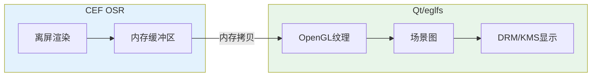
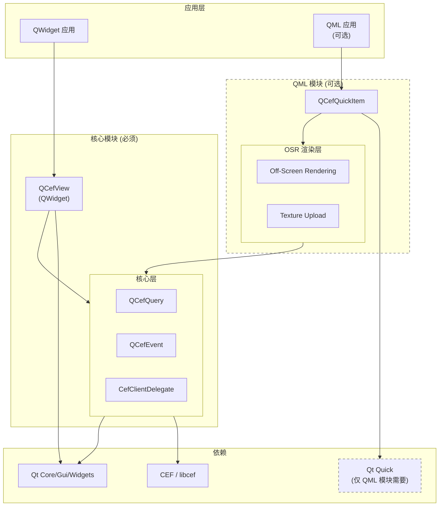
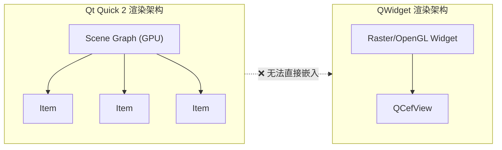
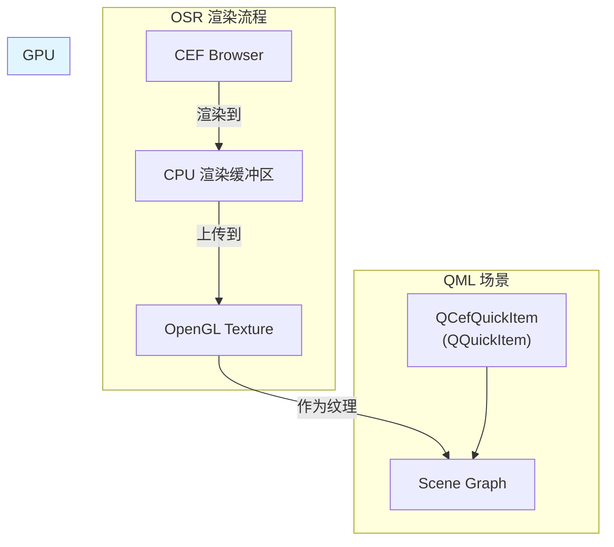
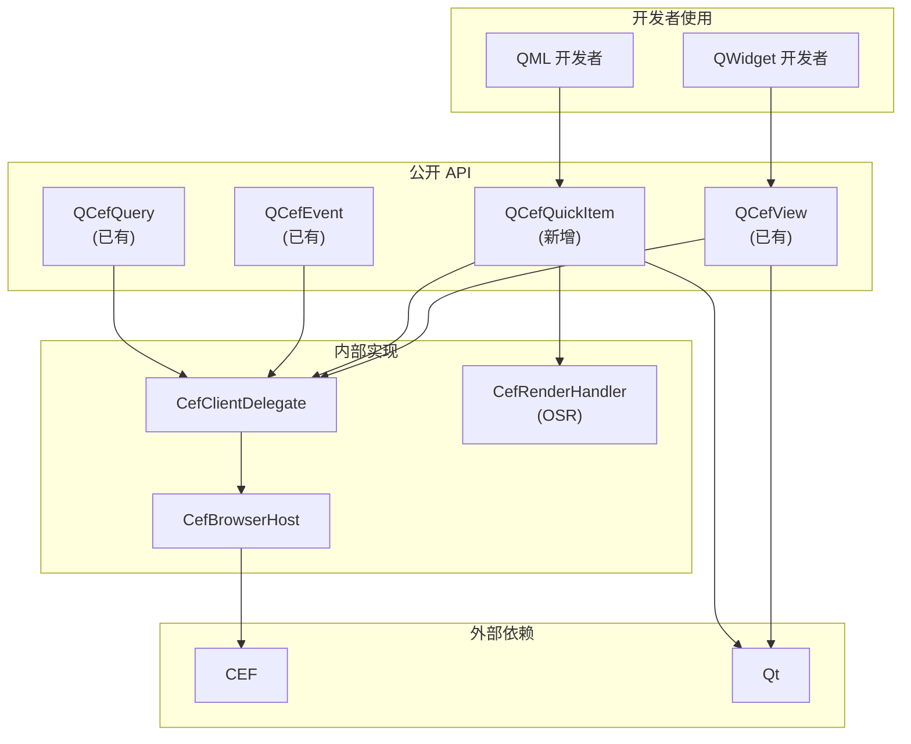
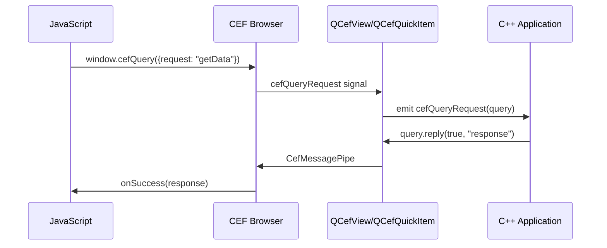
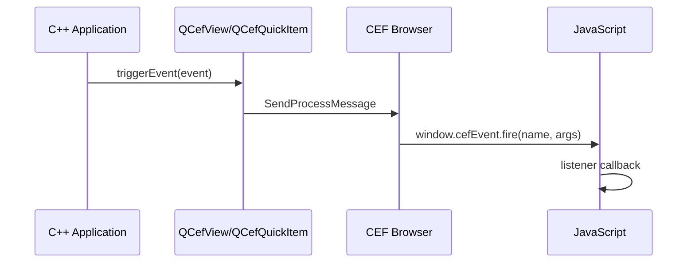
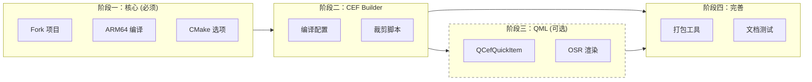

# QCefFrame 框架设计文档

**日期**: 2026-04-09
**版本**: v1.2
**状态**: 开发中 - 阶段一已完成

---

## 1. 项目概述

### 1.1 项目目标

QCefFrame 是一个基于 Qt + CEF 的跨平台桌面应用开发框架，类似 Electron，但专注于：

- **ARM 嵌入式平台支持** - 支持 RK3568 等 ARM64 设备
- **低资源环境优化** - 2GB 内存、页面加载 2s 左右
- **模块化裁剪** - 可配置保留/移除 WebRTC、多媒体等功能
- **Qt 非商业模块** - 仅使用 LGPL/开源许可的 Qt 模块
- **QML 原生支持** - 提供 Qt Quick Item 组件

### 1.2 目标平台

| 平台 | 架构 | 用途 |
|------|------|------|
| Linux ARM64 | aarch64 | 嵌入式设备 (RK3568) |
| Linux x64 | x86_64 | 桌面开发/部署 |
| Windows x64 | x86_64 | 桌面开发/部署 |
| macOS x64 | x86_64 | 桌面开发/部署 |

### 1.3 目标硬件参考

- **CPU**: RK3568 (4核 Cortex-A55 @ 2.0GHz)
- **GPU**: Mali-G52 (支持 OpenGL ES 3.2)
- **内存**: 2GB
- **操作系统**: Buildroot 定制 Linux
- **显示子系统**: DRM/KMS
- **性能目标**: 页面加载 ~2s

### 1.4 QPA 与渲染模式

> 详细分析参见 [嵌入式 Qt QPA 技术选型指南](embedded-qt-qpa-selection.md)

**目标平台 QPA 选择**:

| 平台 | QPA | 渲染模式 | 说明 |
|------|-----|----------|------|
| RK3568 (嵌入式) | eglfs | OSR | 无窗口系统，必须使用离屏渲染 |
| Linux x64 (桌面) | xcb | 窗口模式 | X11环境，CEF原生支持 |
| Windows x64 | windows | 窗口模式 | 原生窗口 |
| macOS x64 | cocoa | 窗口模式 | 原生窗口 |

**eglfs + CEF 技术要点**:



**为什么 eglfs 必须使用 OSR 模式**:

1. eglfs 没有窗口管理器，无法创建原生窗口
2. CEF 窗口模式依赖窗口系统 (X11/Wayland)
3. OSR 模式将网页渲染到内存缓冲区，由 Qt 绘制到屏幕

---

## 2. 架构设计

### 2.1 项目定位

**基于 QCefView Fork 开发**，核心目标：

1. **ARM64 交叉编译** - 完善构建系统支持嵌入式平台 (核心)
2. **CEF 裁剪工具** - 提供模块化功能配置 (核心)
3. **QML 原生支持** - 新增 `QCefQuickItem` (可选)

### 2.2 整体架构



### 2.3 构建选项

| CMake 选项 | 默认 | 说明 |
|-----------|------|------|
| `BUILD_QT_WIDGETS` | ON | 构建 QWidget 支持 (QCefView) |
| `BUILD_QT_QUICK` | OFF | 构建 QML 支持 (QCefQuickItem) |
| `BUILD_EXAMPLES` | ON | 构建示例程序 |
| `BUILD_TESTS` | OFF | 构建测试 |

**使用示例**:
```bash
# 仅 QWidget 支持 (最小依赖)
cmake -DBUILD_QT_QUICK=OFF ..

# 启用 QML 支持
cmake -DBUILD_QT_QUICK=ON ..
```

### 2.4 技术选型

| 组件 | 选型 | 理由 |
|------|------|------|
| GUI 框架 | Qt 5/6 (LGPL) | 跨平台、非商业许可、成熟稳定 |
| Web 引擎 | CEF (Chromium Embedded Framework) | 类 Electron 体验、可裁剪 |
| 基础项目 | QCefView (Fork) | 成熟稳定、避免重复造轮子 |
| JS-C++ 通信 | QCefQuery / QCefEvent | 已有成熟机制 |
| 构建系统 | CMake | 跨平台、Qt 原生支持 |
| QML 渲染 | OSR (Off-Screen Rendering) | 解决 QWidget 无法嵌入 Qt Quick 场景图的问题 |

### 2.5 设计决策

| 决策点 | 选择 | 理由 |
|--------|------|------|
| 项目形态 | Fork QCefView | QML 支持需要修改核心代码，封装无法解决 |
| **嵌入式 QPA** | **eglfs** | RK3568 有 GPU，无窗口系统，DRM/KMS 原生支持 |
| **嵌入式 CEF 模式** | **OSR (强制)** | eglfs 无窗口管理器，CEF 窗口模式不可用 |
| QML 渲染方式 | OSR 模式 | QWidget 无法嵌入 Qt Quick 2 场景图 |
| JS-C++ 通信 | 复用 QCefQuery/Event | 已有成熟机制，无需重新设计 |
| CEF 裁剪策略 | 分层策略 | ARM 嵌入式编译裁剪，桌面端预编译 |
| WebRTC 支持 | 可配置 | 根据需求动态配置 |

---

## 3. QML 支持技术方案

### 3.1 问题分析



**核心问题**: Qt Quick 2 使用 Scene Graph 在 GPU 上渲染，而 QWidget 使用传统的 Raster/OpenGL Widget 渲染，两者架构不兼容。

### 3.2 解决方案: OSR 模式



**工作流程**:

1. CEF 使用 OSR 模式渲染到 CPU 缓冲区
2. 将缓冲区内容上传到 OpenGL 纹理
3. QQuickItem 将纹理作为 Scene Graph 的一部分渲染

### 3.3 QML 组件设计

```cpp
// QCefQuickItem.h
class QCefQuickItem : public QQuickItem {
    Q_OBJECT
    Q_PROPERTY(QString url READ url WRITE setUrl NOTIFY urlChanged)
    Q_PROPERTY(bool enableWebRTC READ enableWebRTC WRITE setEnableWebRTC)

public:
    // 页面操作
    Q_INVOKABLE void loadUrl(const QString& url);
    Q_INVOKABLE void reload();

    // JS 通信 (复用 QCefQuery/Event)
    Q_INVOKABLE void sendEvent(const QString& name, const QVariantList& args);

signals:
    void urlChanged();
    void loadFinished(bool success);
    void cefQueryRequest(const QString& request, qint64 queryId);

protected:
    // QSG 渲染
    QSGNode* updatePaintNode(QSGNode* oldNode, UpdatePaintNodeData*) override;

private:
    // OSR 渲染上下文
    std::unique_ptr<CefRenderHandler> m_renderHandler;
    GLuint m_textureId = 0;
};
```

---

## 4. 模块设计

### 4.1 模块关系图



### 4.2 JS-C++ 通信机制 (复用 QCefView 已有机制)

#### 4.2.1 JS → C++ (QCefQuery)



#### 4.2.2 C++ → JS (QCefEvent)



### 4.3 QML 使用示例

```qml
import QtQuick 2.15
import QCefView 1.0

Item {
    width: 800
    height: 600

    QCefQuickItem {
        id: webView
        anchors.fill: parent
        url: "https://example.com"
        enableWebRTC: true

        // 页面加载完成
        onLoadFinished: function(success) {
            console.log("Page loaded:", success)
        }

        // 接收 JS 查询请求
        onCefQueryRequest: function(request, queryId) {
            if (request === "getUserInfo") {
                // 处理并回复
                webView.replyQuery(queryId, true, 
                    JSON.stringify({name: "John", age: 25}))
            }
        }

        // 发送事件到 JS
        Button {
            text: "Send Event"
            onClicked: {
                webView.sendEvent("notify", ["Hello from QML"])
            }
        }
    }
}
```

### 4.4 JavaScript 使用示例

```javascript
// 发送查询到 C++
window.cefQuery({
    request: JSON.stringify({action: "getUserInfo", userId: 123}),
    onSuccess: function(response) {
        console.log("Response:", response);
    },
    onFailure: function(error) {
        console.error("Error:", error);
    }
});

// 监听 C++ 事件
window.cefEvent.addEventListener("notify", function(message) {
    console.log("Received:", message);
});
```

---

## 5. 项目结构 (当前)

```
QCefFrame/                           # Fork 自 QCefView
│
├── include/                          # 公开头文件
│   ├── QCefView.h                    # QWidget 版本 (核心)
│   ├── QCefEvent.h                   # 事件类 (核心)
│   ├── QCefQuery.h                   # 查询类 (核心)
│   ├── QCefSetting.h                 # 设置类 (核心)
│   └── QCefConfig.h                  # 配置类 (核心)
│
├── src/                              # 源代码 (~10,000 行)
│   ├── QCefView.cpp
│   ├── details/
│   │   ├── QCefViewPrivate.cpp
│   │   └── handler/
│   └── linux/
│
├── cmake/                            # CMake 配置
│   └── toolchain-linux-arm64.cmake   # ARM64 交叉编译工具链 ✅
│
├── tools/                            # 构建工具 ✅
│   └── buildroot/                    # Buildroot 集成
│       ├── setup-buildroot-env.sh    # 环境设置脚本
│       └── package/qceframe/         # Buildroot 包定义
│
├── example/                          # 示例程序
│   └── QCefViewTest/                 # QWidget 示例
│
├── wiki/                             # 项目文档 ✅
│   ├── analysis/                     # 架构分析
│   │   ├── qcefview-architecture.md
│   │   ├── qcefview-api-reference.md
│   │   └── code-statistics.md
│   ├── build/                        # 构建指南
│   │   ├── arm64-cross-compile.md
│   │   └── buildroot-integration.md
│   ├── design/                       # 设计文档
│   └── plans/                        # 实施计划
│
├── generate-linux-x86_64.sh          # x86_64 构建脚本 ✅
├── generate-linux-arm64.sh           # ARM64 构建脚本 ✅
├── CMakeLists.txt
└── README.md
```

---

## 6. CEF 裁剪策略

### 6.1 功能模块

| 模块 | 描述 | 默认 | 可配置 |
|------|------|------|--------|
| WebGL | 3D 图形渲染 | ✓ | 是 |
| Canvas 2D | 2D 图形渲染 | ✓ | 是 |
| WebRTC | 音视频通信 | ✗ | 是 |
| Audio | 音频播放 | ✓ | 是 |
| Video Decode | 视频解码 | ✓ | 是 |
| PDF Viewer | PDF 查看 | ✗ | 是 |
| Extensions | 浏览器扩展 | ✗ | 是 |
| Printing | 打印功能 | ✗ | 是 |
| Spellcheck | 拼写检查 | ✗ | 是 |
| DevTools | 开发者工具 | ✓ | 是 |

### 6.2 预设配置

```yaml
# tools/cef-builder/configs/webrtc.yml
features:
  webgl: true
  canvas_2d: true
  webrtc: true
  audio: true
  video_decode: [h264, h265, vp8, vp9]
  pdf_viewer: false
  extensions: false
  printing: false

target:
  platform: linux-arm64
  toolchain: aarch64-linux-gnu
```

### 6.3 平台策略

| 平台 | CEF 来源 | 裁剪方式 |
|------|----------|----------|
| Linux ARM64 | 自编译 | 编译时裁剪 |
| Linux x64 | 预编译 | 运行时配置 |
| Windows x64 | 预编译 | 运行时配置 |
| macOS x64 | 预编译 | 运行时配置 |

---

## 7. 开发计划

### 7.1 阶段划分



### 7.2 详细任务

**阶段一：核心建设** ✅ 完成 (2026-04-10)
- [x] Fork QCefView 仓库 → github.com/JunJunHub/QCefFrame
- [x] 保持原项目名称 QCefView，添加 ARM64 支持
- [x] 添加 ARM64 交叉编译 CMake 配置 (`cmake/toolchain-linux-arm64.cmake`)
- [x] 添加构建脚本 (`generate-linux-arm64.sh`)
- [x] 验证 Linux x86_64 编译流程
- [ ] 验证 ARM64 编译流程 (需要 Buildroot Qt6 环境)

**阶段二：CEF Builder** (待开始)
- [ ] CEF 编译配置解析
- [ ] ARM64 交叉编译脚本
- [ ] 功能模块化裁剪配置

**阶段三：QML 支持** (待开始) - 可选
- [ ] 实现 QCefQuickItem 类
- [ ] 集成 CEF OSR 渲染
- [ ] 实现纹理上传到 Scene Graph
- [ ] 复用 QCefQuery/Event 通信机制
- [ ] 创建 QML 示例应用

**阶段四：完善与测试** (待开始)
- [ ] 打包工具
- [ ] API 文档
- [ ] 单元测试
- [ ] 集成测试

**Buildroot 集成** ✅ 完成 (2026-04-10)
- [x] 环境设置脚本 (`tools/buildroot/setup-buildroot-env.sh`)
- [x] 包定义 (`tools/buildroot/package/qceframe/`)
- [x] 集成指南 (`wiki/build/buildroot-integration.md`)

---

## 8. 依赖项

### 8.1 核心依赖 (QWidget 支持)

| 依赖 | 版本 | 许可证 | 说明 |
|------|------|--------|------|
| CEF | 6722+ (Chromium 134+) | BSD | Chromium 嵌入框架 |
| Qt Core | 5.15+ / 6.x | LGPL v3 | Qt 核心模块 |
| Qt Gui | 5.15+ / 6.x | LGPL v3 | Qt GUI 模块 |
| Qt Widgets | 5.15+ / 6.x | LGPL v3 | Qt Widgets 模块 |
| CMake | 3.16+ | BSD | 构建系统 |

### 8.2 QML 模块依赖 (可选)

启用 `BUILD_QT_QUICK=ON` 时需要：

| 依赖 | 版本 | 许可证 | 说明 |
|------|------|--------|------|
| Qt Quick | 5.15+ / 6.x | LGPL v3 | Qt Quick 模块 |
| Qt QML | 5.15+ / 6.x | LGPL v3 | Qt QML 模块 |
| Qt QuickControls2 | 5.15+ / 6.x | LGPL v3 | Qt Quick 控件 (示例需要) |

### 8.3 开发工具 (可选)

| 依赖 | 用途 |
|------|------|
| Python 3.8+ | 打包工具脚本 |
| Doxygen | API 文档生成 |
| aarch64-linux-gnu-gcc | ARM64 交叉编译工具链 |

### 8.4 依赖对比

| 配置 | Qt 模块 | 适合场景 |
|------|---------|----------|
| 仅 QWidget | Core, Gui, Widgets | 嵌入式设备、传统桌面应用 |
| QWidget + QML | Core, Gui, Widgets, Quick, QML | 现代 UI 应用、触屏交互 |

---

## 9. 风险与缓解

| 风险 | 影响 | 缓解措施 |
|------|------|----------|
| QCefView 上游更新 | 中 | 定期同步上游代码 |
| OSR 渲染性能 | 中 | 优化纹理上传，使用 GPU 加速 |
| CEF ARM64 编译复杂 | 中 | 参考官方文档，逐步验证 |
| WebRTC 编译依赖多 | 中 | 使用 GN 内置 webrtc 配置 |

---

## 10. 参考资料

### 10.1 QCefView 原项目文档

- [QCefView 文档首页](https://cefview.github.io/QCefView/) - 完整 API 文档
- [QCefView 类列表](https://cefview.github.io/QCefView/annotated.html) - 所有公开类
- [QCefView 仓库](https://github.com/CefView/QCefView) - 源码仓库

**核心类**:
| 类名 | 说明 |
|------|------|
| `QCefView` | CEF 浏览器视图 (QWidget) |
| `QCefQuery` | JS → C++ 查询请求 |
| `QCefEvent` | C++ → JS 事件 |
| `QCefSetting` | 浏览器设置 |
| `QCefConfig` | 应用配置 |
| `QCefContext` | CEF 上下文 |
| `QCefDownloadItem` | 下载项 |

### 10.2 CEF 相关

- [CEF 官方文档](https://bitbucket.org/chromiumembedded/cef/src/master/)
- [CEF OSR 示例](https://bitbucket.org/chromiumembedded/cef/src/master/tests/cefclient/)
- [CEF 预编译下载](https://cef-builds.spotifycdn.com/index.html)

### 10.3 Qt 相关

- [Qt 文档](https://doc.qt.io/)
- [Qt Quick Scene Graph](https://doc.qt.io/qt-6/qtquick-visualcanvas-scenegraph.html)
- [QQuickItem 文档](https://doc.qt.io/qt-6/qquickitem.html)
