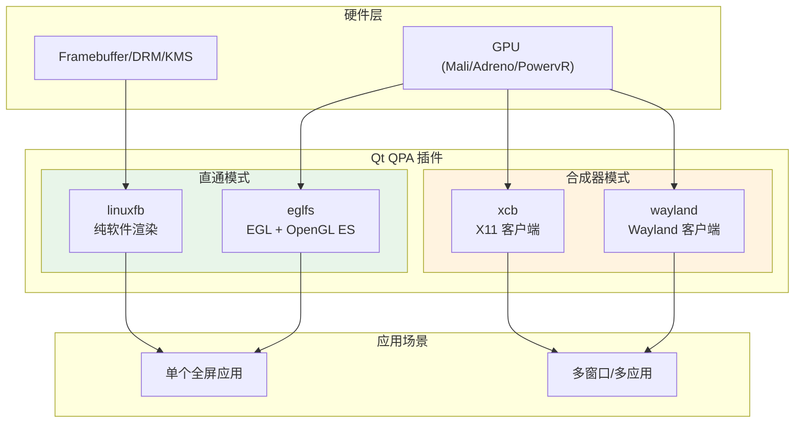
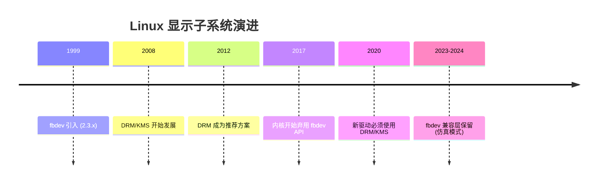
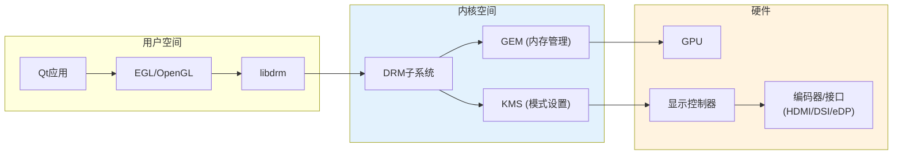
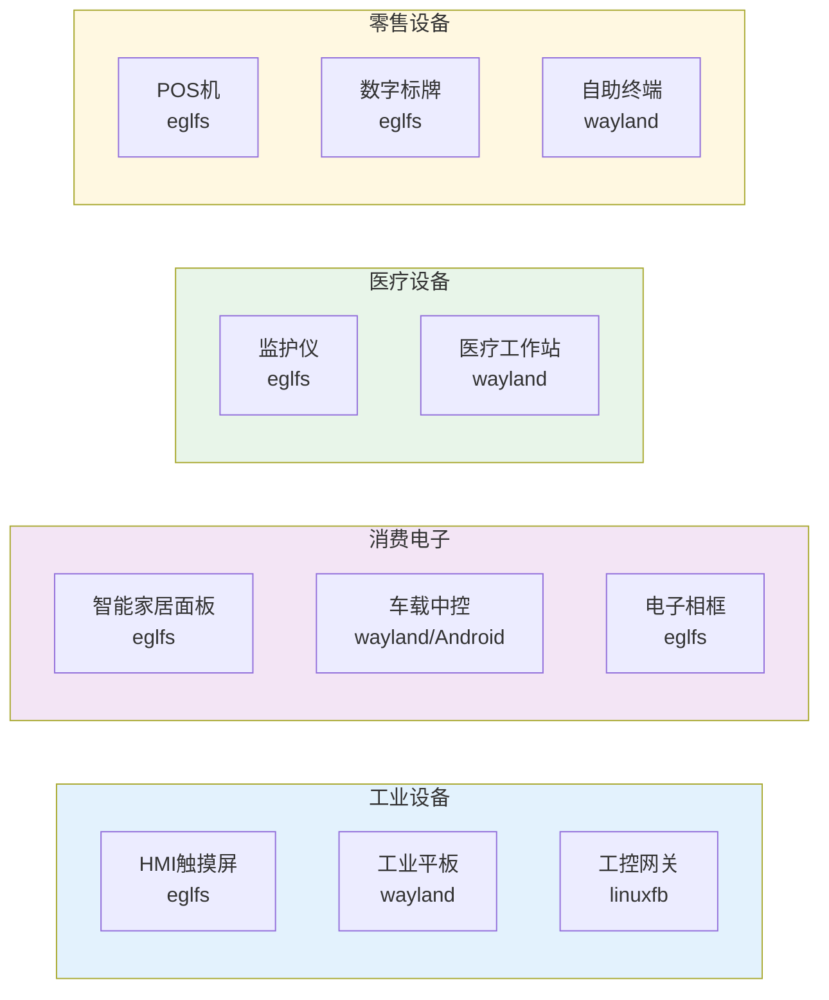
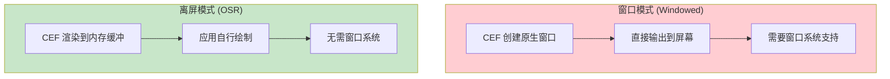
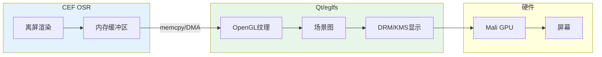
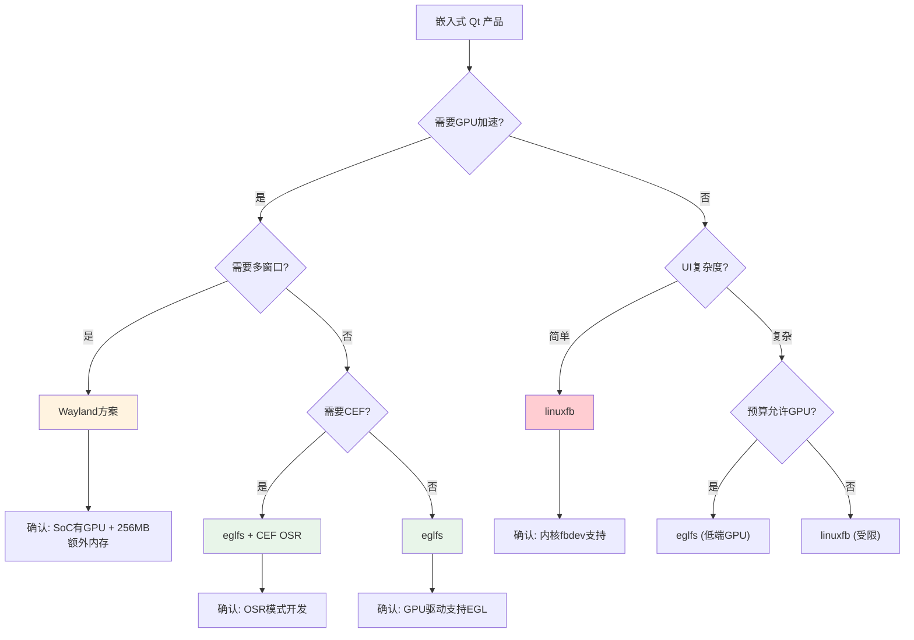

# 嵌入式 Qt QPA 技术选型指南

**日期**: 2026-04-10
**版本**: v1.0
**用途**: 后续产品技术选型参考

---

## 1. 概述

本文档分析嵌入式 Linux 平台上 Qt 应用程序的 QPA (Qt Platform Abstraction) 选择策略，作为产品技术选型的决策依据。

---

## 2. QPA 方案对比

### 2.1 架构图



### 2.2 详细对比

| 特性 | eglfs | linuxfb | wayland | xcb (X11) |
|------|-------|---------|---------|-----------|
| **GPU 要求** | 必须 | 不需要 | 必须 | 可选 |
| **内存占用** | 最低 | 低 | 中等 (+128MB) | 高 (+256MB) |
| **多窗口支持** | ❌ | ❌ | ✅ | ✅ |
| **窗口合成** | ❌ | ❌ | ✅ 合成器负责 | ✅ X服务器负责 |
| **启动速度** | 快 | 最快 | 中等 | 慢 |
| **系统复杂度** | 简单 | 最简单 | 复杂 | 最复杂 |
| **CEF 窗口模式** | ⚠️ 需OSR | ❌ 不适合 | ✅ 支持 | ✅ 支持 |
| **CEF OSR模式** | ✅ 推荐 | ⚠️ 性能差 | ✅ 支持 | ✅ 支持 |

### 2.3 内存开销估算

| 方案 | 基础内存 | 显示相关 | 总计 (估算 ) |
|------|----------|----------|--------------|
| eglfs | 50-100MB | GPU缓冲 ~30MB | 80-130MB |
| linuxfb | 30-50MB | Framebuffer ~10MB | 40-60MB |
| wayland | 80-120MB | 合成器 + GPU | 150-200MB |
| X11 | 100-150MB | X服务器 + GPU | 200-300MB |

---

## 3. 内核显示子系统演进

### 3.1 发展历程



### 3.2 fbdev 状态

| 内核版本 | fbdev 状态 | 说明 |
|----------|------------|------|
| Linux 4.x | ✅ 正常使用 | 新驱动推荐 DRM |
| Linux 5.x | ⚠️ 部分弃用 | 更多驱动移至 staging |
| Linux 6.x | ⚠️ 仅仿真 | 新硬件必须用 DRM/KMS |

**关键结论**:
- fbdev API 未被完全移除
- 新硬件驱动不再接受纯 fbdev 实现
- 现有 fbdev 接口通过 DRM fbdev 仿真提供

### 3.3 DRM/KMS 架构



---

## 4. 硬件选型要求

### 4.1 各方案硬件要求

#### eglfs 方案

```
硬件要求：
├── SoC: 带GPU的ARM芯片 (Mali/Adreno/PowervR)
├── GPU驱动: 必须有 EGL/OpenGL ES 支持
├── 内存: 512MB+ 可运行Qt应用
├── 显示: DRM/KMS 支持
└── 内核: Linux 5.x+ (推荐 6.x)

典型硬件：
├── RK3568 (Mali-G52)      ← 当前目标
├── RK3399 (Mali-T860)
├── RK3588 (Mali-G610)
├── i.MX8M (GC7000L)
├── Allwinner A64 (Mali-450)
├── 树莓派4 (VideoCore VI)
└── TI AM62 (SGX544)
```

#### linuxfb 方案

```
硬件要求：
├── SoC: 任意ARM芯片 (无GPU也可)
├── 显示: 帧缓冲接口 /dev/fb0
├── 内存: 256MB+ (纯软件渲染)
└── 内核: 需fbdev支持 (或DRM仿真)

典型硬件：
├── 无GPU的低端MCU
├── 旧款SoC (树莓派Zero)
├── 简单工业HMI
└── 成本敏感产品

⚠️ 警告: 新内核(6.x)新硬件不支持纯fbdev驱动
```

#### Wayland 方案

```
硬件要求：
├── SoC: 带GPU的ARM芯片 (同eglfs)
├── 内存: 256MB+ 额外开销 (合成器)
├── CPU: 更强 (窗口合成计算)
└── 软件: Wayland Compositor (weston/mutter)

典型硬件：
├── i.MX8 + NXP BSP (官方推荐)
├── TI AM62/AM57
├── RK3588 (高端方案)
├── Intel Apollo Lake (工业平板)
└── 车载中控平台
```

#### X11 方案

```
硬件要求：
├── CPU: 较强 (X服务器开销大)
├── 内存: 256MB+ 额外开销
├── GPU: 可选 (软件渲染也可)
└── 存储: 较大 (X服务器 + 依赖)

典型硬件：
├── Intel x86 工控机
├── 高端ARM开发板
└── 通用Linux PC

⚠️ 不推荐嵌入式新项目使用
```

### 4.2 各厂商支持情况

| SoC 厂商 | 型号示例 | 内核版本 | fbdev | DRM/KMS | GPU | 推荐 QPA |
|----------|----------|----------|-------|---------|-----|----------|
| **Rockchip** | RK3568 | 5.10/5.15 | 仿真 | ✅ 主推 | Mali-G52 | eglfs |
| **Rockchip** | RK3399 | 5.10/5.15 | 仿真 | ✅ 主推 | Mali-T860 | eglfs |
| **Rockchip** | RK3588 | 6.1 | 仿真 | ✅ 主推 | Mali-G610 | eglfs |
| **NXP** | i.MX8M | 5.15/6.1 | 遗留 | ✅ 主推 | GC7000L | eglfs/wayland |
| **TI** | AM62 | 6.1 | ❌ | ✅ 唯一 | SGX544 | eglfs |
| **TI** | AM57xx | 5.10 | 遗留 | ✅ 主推 | SGX530 | eglfs |
| **Allwinner** | A64/H6 | 5.15/6.1 | 仿真 | ✅ 主推 | Mali-450/720 | eglfs |
| **树莓派** | Pi 4 | 6.1 | 仿真 | ✅ 主推 | VideoCore VI | eglfs |
| **树莓派** | Pi Zero | 6.1 | 有限 | ⚠️ | VideoCore IV | linuxfb |

---

## 5. 市场产品分析

### 5.1 应用场景分类



### 5.2 实际产品案例

| 产品类型 | QPA选择 | 典型硬件 | 原因 |
|----------|---------|----------|------|
| **工业HMI** | eglfs | RK3288/RK3399 | 单应用全屏、低延迟 |
| **智能家居面板** | eglfs | ESP32-S3/全志 | 低成本、单应用 |
| **车载中控** | Wayland/Android | TDA4/RK3588 | 多应用、安全隔离 |
| **医疗监护仪** | eglfs | i.MX8M | 实时性、单应用 |
| **医疗工作站** | Wayland | Intel x86 | 多应用协作 |
| **POS收银机** | eglfs | RK3288 | 单应用、成本控制 |
| **工业网关** | linuxfb | STM32MP1 | 无GPU、简单UI |
| **数字标牌** | eglfs | RK3399 | 全屏播放、24h运行 |
| **自助终端** | Wayland | Intel x86 | 多应用、触摸交互 |
| **电梯楼层屏** | linuxfb | 低端MCU | 无GPU、静态内容 |

### 5.3 市场占比估算 (2024)

```
嵌入式 Qt 应用 QPA 分布:

eglfs:    ████████████████████ 65%  ← 主流选择
wayland:  ████████             25%  ← 高端/多应用
linuxfb:  ███                   8%  ← 低成本无GPU
X11:      ██                    2%  ← 遗留系统/x86
```

---

## 6. CEF 兼容性分析

### 6.1 CEF 渲染模式

CEF (Chromium Embedded Framework) 有两种渲染模式：



### 6.2 QPA 与 CEF 兼容性矩阵

| QPA | CEF 窗口模式 | CEF OSR模式 | 推荐方案 |
|-----|-------------|-------------|----------|
| **eglfs** | ❌ 不支持 | ✅ 推荐 | OSR模式 |
| **linuxfb** | ❌ 不支持 | ⚠️ 性能差 | 不推荐CEF |
| **wayland** | ✅ 支持 | ✅ 支持 | 窗口模式 |
| **X11/xcb** | ✅ 支持 | ✅ 支持 | 窗口模式 |

### 6.3 eglfs + CEF 技术方案



**性能考量**:

| 方面 | 影响 | 缓解措施 |
|------|------|----------|
| 内存拷贝 | CPU开销 ~10-20% | DMA传输、共享内存 |
| 双缓冲 | 内存 +50-100MB | 控制分辨率 |
| 帧率 | 可能降低 | 硬件加速拷贝 |

---

## 7. 技术选型决策树



---

## 8. 推荐配置

### 8.1 按产品类型推荐

| 产品类型 | QPA | 硬件建议 | 内存建议 | CEF支持 |
|----------|-----|----------|----------|---------|
| 工业HMI | eglfs | RK3568/RK3399 | 1-2GB | OSR |
| 智能面板 | eglfs | 全志A64/RK3568 | 512MB-1GB | OSR |
| 车载中控 | wayland | RK3588/TDA4 | 4GB+ | 窗口 |
| 医疗监护 | eglfs | i.MX8M | 2GB | OSR |
| POS机 | eglfs | RK3288 | 1GB | 不需要 |
| 数字标牌 | eglfs | RK3399 | 2GB | OSR |
| 自助终端 | wayland | Intel x86 | 4GB+ | 窗口 |
| 简单网关 | linuxfb | STM32MP1 | 256MB | ❌ |

### 8.2 RK3568 推荐配置

```
目标平台: RK3568
├── QPA: eglfs (Mali-G52 + DRM/KMS)
├── 内核: Linux 5.10+ 或 6.1
├── Qt: 5.15 或 6.x
├── GPU驱动: Mali G52 GLES3.2
├── 内存: 2GB (CEF应用推荐)
├── CEF模式: OSR (离屏渲染)
└── Buildroot: 启用 DRM/Mesa/Mali
```

---

## 9. 风险与注意事项

### 9.1 技术风险

| 风险 | 影响 | 缓解措施 |
|------|------|----------|
| GPU驱动不完善 | 高 | 选型前验证EGL/ES支持 |
| fbdev未来移除 | 中 | 新项目使用DRM/KMS |
| CEF OSR性能 | 中 | 优化内存拷贝 |
| Wayland兼容性 | 中 | 选择成熟compositor |
| 内存不足 | 高 | 预留足够余量 |

### 9.2 选型检查清单

- [ ] SoC 是否有 GPU 支持
- [ ] GPU 驱动是否提供 EGL/OpenGL ES
- [ ] 内核是否支持 DRM/KMS
- [ ] 内存是否满足 QPA + 应用需求
- [ ] CEF 应用需要评估 OSR 模式开销
- [ ] Buildroot/Build 系统是否支持目标 QPA

---

## 10. 参考资料

### 10.1 官方文档

- [Qt Platform Abstraction](https://doc.qt.io/qt-6/qpa.html)
- [Qt eglfs Platform Plugin](https://doc.qt.io/qt-6/embedded-linux.html)
- [DRM/KMS Documentation](https://www.kernel.org/doc/html/latest/gpu/drm-kms.html)
- [CEF OSR Guide](https://bitbucket.org/chromiumembedded/cef/src/master/tests/cefclient/)

### 10.2 相关文档

- [QCefFrame 设计文档](2026-04-09-framework-design.md)
- [Buildroot 集成指南](../build/buildroot-integration.md)
- [ARM64 交叉编译指南](../build/arm64-cross-compile.md)

---

## 11. 更新记录

| 日期 | 版本 | 更新内容 |
|------|------|----------|
| 2026-04-10 | v1.0 | 初始版本，完整QPA选型分析 |
